<!-- animated contribution graph: real data, boxes reveal cell by cell
     (regenerated daily by .github/workflows/update-profile-art.yml) -->
<h3><code>humayun@github ~ $ ./contributions.sh</code></h3>

 
 

<!-- ascii portrait (left) + neofetch info card (right)
     portrait: python scripts/prep_photo.py && python scripts/make_ascii_svg.py
     card:     python scripts/make_info_card.py -->
<h3><code>humayun@github ~ $ whoami</code></h3>

<table>
<tr>
<td valign="top"></td>
<td valign="top"></td>
</tr>
</table>

 
 

<h3><code>humayun@github ~ $ ./links.sh</code></h3>

<b>Full-Stack Developer • Next.js • React • TypeScript • Web3</b>

 

---

<h3><code>humayun@github ~ $ cat about.txt</code></h3>

> Software engineer focused on modernizing legacy systems into secure, scalable, and production-ready software. Delivering end-to-end solutions from responsive UI architecture to backend services, smart contracts, and AI-powered workflows.

- 💼 **Current Role**: AR Associate @ **Macksofy Technologies** (working on billing & revenue cycle operations for Samar Health, US)
- ⚡ **Recent Experience**: Former Lead Web Developer Intern @ **EVJoints** (built full-stack EV trip-planning admin dashboard)
- 🎓 **Education**: B.E. Computer Science & Engineering (IoT, Cyber Security & Blockchain)
- 💡 **Core Expertise**: React 18, Next.js 14, TypeScript, Node.js, Express, PostgreSQL, Prisma, Solidity, Web3.js, Python

 

---

<h3><code>humayun@github ~ $ ./honors.sh</code></h3>

| Award / Recognition | Organization |
| :--- | :--- |
| 🏆 **Best Portfolio Winner** | The Elite Guild (National) |
| 🥇 **Clash of Codes 2.0 Winner** | Terna College of Engineering |
| 🥇 **1st Place – IEEE Digital Poster** | IEEE MHSSCE |
| 🏅 **Best Programmer Award** | A.R. Kalsekar Polytechnic |

 

---

<h3><code>humayun@github ~ $ ./featured-projects.sh</code></h3>

<table>
<tr>

<td width="33%" align="center">

### 🚆 RailCon MHSSCE

Enterprise railway concession management system with automated verification workflows, PWA support, and A+ security ratings.

**React 18 • TypeScript • PostgreSQL • Drizzle • Express • PWA**

<a href="https://railcon.vercel.app/">🌐 Live Demo</a>

</td>

<td width="33%" align="center">

### 🩺 FORESEE

AI-powered healthcare platform for disease diagnosis & outbreak forecasting with CNN parasite detection and epidemiology screening.

**Next.js • Flask • Python • TensorFlow • PostgreSQL • Docker**

<a href="https://foreseehealth.vercel.app/">🌐 Live</a> • <a href="https://github.com/HumayunK01/CodeRedProject">💻 Source</a>

</td>

<td width="33%" align="center">

### 🔗 SecureChain

Blockchain-based pharmaceutical supply chain with Soulbound Token identity and Merkle tree batch verification. 99.98% gas reduction.

**Solidity • Ethereum • Hardhat • Next.js 14 • Web3.js • IPFS**

<a href="https://github.com/HumayunK01/SupplyChainBlockchain">💻 Source Code</a>

</td>

</tr>

<tr>

<td align="center">

### 🤖 ChatFlow

Feature-rich AI chat application powered by OpenRouter, multi-model selection, real-time streaming, personas, and web search.

**React 18 • TypeScript • Vite • Tailwind • OpenRouter API**

<a href="https://chatflowaibot.vercel.app/">🌐 Live Demo</a> • <a href="https://github.com/HumayunK01/ChatFlow">💻 Source</a>

</td>

<td align="center">

### 🛡️ PhishEye

OSINT cybersecurity threat detection platform for analyzing potential scam and phishing websites in real-time.

**React 18 • TypeScript • Express.js • Node.js • OSINT APIs**

<a href="https://phisheye.vercel.app/">🌐 Live Demo</a> • <a href="https://github.com/HumayunK01/PhishEye">💻 Source</a>

</td>

<td align="center">

### 🏨 Asmeera Stays

High-conversion luxury villa booking platform in Lonavala featuring immersive visuals and performant UI.

**React 18 • TypeScript • Vite • Tailwind CSS • Framer Motion**

<a href="https://asmeerastays.com/">🌐 Live Demo</a>

</td>

</tr>
</table>

 

---

<h3><code>humayun@github ~ $ cat stack.txt</code></h3>

 

Thanks for stopping by! ⭐ Star a repo or connect on <a href="https://www.linkedin.com/in/devhumayun/">LinkedIn</a> / <a href="https://humayun.in/">humayun.in</a>.

